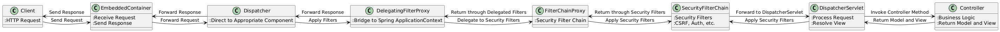
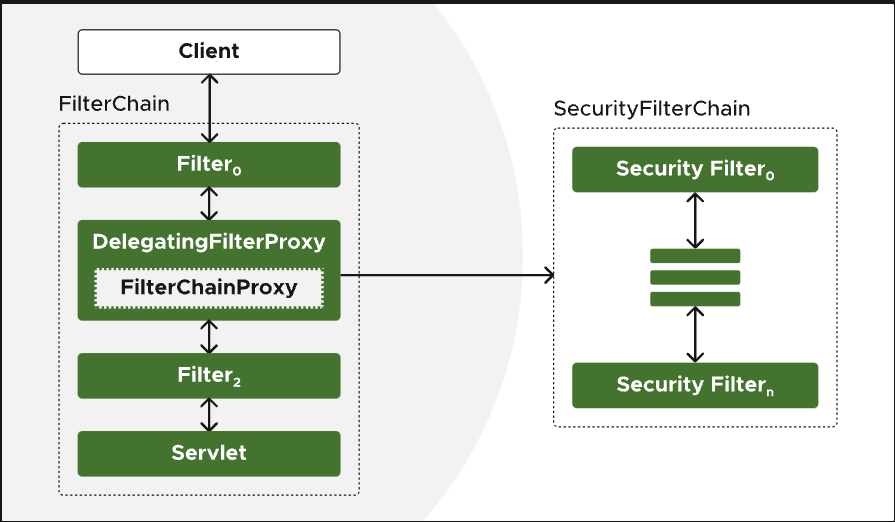
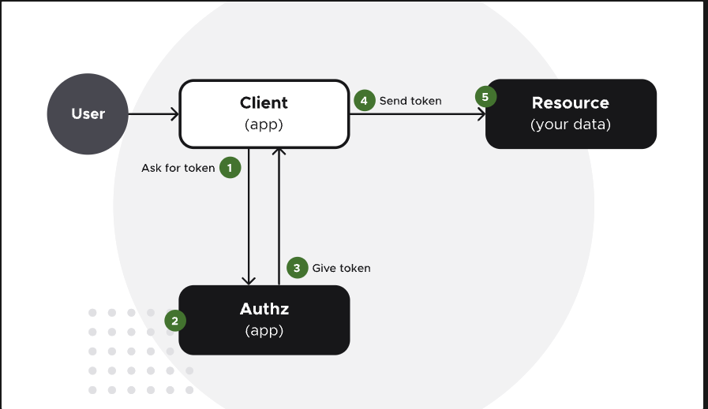

# spring-security-demo
Spring boot project with Spring Security and OAuth 2.0

This project just following the step by step about how to convert an insecure Rest API into a better secure Rest API 
with Spring Security and OAuth 2.0 specification.

Source: https://spring.academy/courses/spring-academy-secure-rest-api-oauth2

# What is Spring Security
Spring Security is a powerful and highly customizable authentication and access-control framework. It is the de-facto standard for securing Spring-based applications.
The framework secure the following principles:
- Secure by default.
- Principle of the least privilege.

*Spring Security embraces both of these philosophies to automatically secure REST APIs.*

# Request workflow


1. Client sends an HTTP request to the application.
2. Embedded Container receives the request and passes it to the Dispatcher.
3. Dispatcher forwards the request to the `DelegatingFilterProxy`.
4. `DelegatingFilterProxy` delegates to the `FilterChainProxy`. 
5. `FilterChainProxy` processes the request through a series of Security Filters (like CSRF, authentication, etc.). 
6. The filtered request is then forwarded to the `DispatcherServlet`. 
7. `DispatcherServlet` handles the request by invoking the appropriate Controller method. 
8. The Controller processes the request, performs business logic, and returns a model and view. 
9. The response follows the reverse path through the Security Filters. 
10. Finally, the Embedded Container sends the response back to the Client.

# The Filter Chain
The Spring Security filter chain is a set of security filters that are run in sequence on each request.



# OAuth 2.0 and JWT Overview



OAuth 2.0: An authorization framework that allows client applications to access resources on behalf of a user without handling their passwords directly. Users authenticate directly with an Authorization Server, which issues short-lived access tokens to the client application.

JWT (JSON Web Tokens): A standardized format for access tokens containing headers (metadata) and claims (permissions and user identity). JWTs are signed by the Authorization Server, ensuring integrity and authenticity when verified by the Resource Server.

Key Benefits:

Enhanced security by minimizing exposure of user credentials.
Tokens are short-lived and specific to the permissions granted.

# Authentication Server call
The following docker image provide a project that it will simulate an Authorization Server
to get a token for call the Resource Server:
```txt
docker run --rm --name sso -p 9000:9000 ghcr.io/vmware-tanzu-learning/course-secure-rest-api-oauth2-code/sso:latest
```